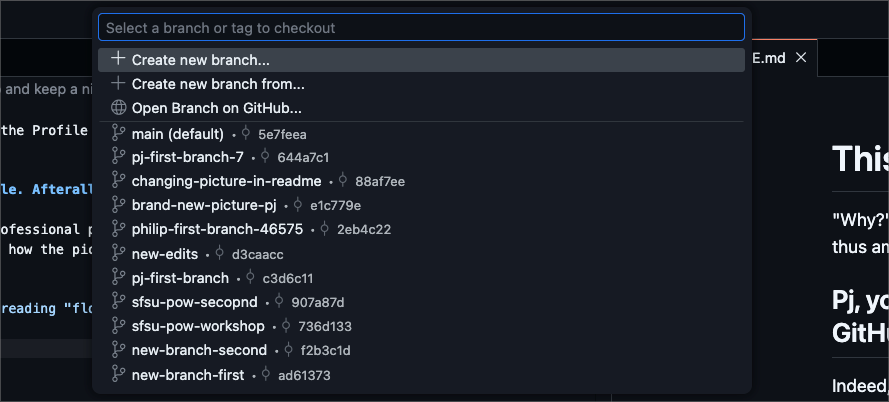
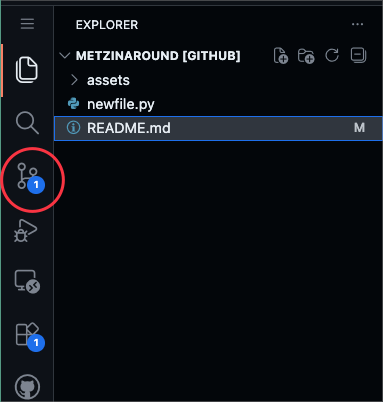

# Lesson Plan: Creating Your Profile README on GitHub

## Overview

A Profile README is a great way to introduce yourself to the GitHub community. It serves as your “About Me” page on your GitHub profile. You'll learn how to create a GitHub repository that displays a README on your profile, use Markdown to add details about yourself, and use basic GitHub workflow concepts such as branching and Pull Requests.

---

## Instructions

### 1\. Create Your Special Profile Repository

1. **Log in to GitHub.**  
2. In the top-right corner, click your profile picture and select **"Your repositories"**.  
3. Click the green **“New”** button at the top-right.  
4. **Important:**  
   Under **"Repository name"**, **type your GitHub username exactly**.  
   *For example, if your username is `octocat`, enter `octocat` as the repository name.*  
5. Optionally, type a short description (e.g., “My personal repository.”)  
6. Set **Visibility** to **Public**.  
7. Under "Initialize this repository with", turn **README** to **On**.  
8. Click **Create repository**.

---

### 2\. Open the Repository in GitHub Web Editor

1. On your new repository’s page, press the period (`.`) key on your keyboard.  
   This opens the GitHub web-based editor — a tool that looks and works like VSCode.  
2. You’ll see your README.md file already created and ready to edit.  
3. Note the comments in the file that disappear when they are rendered. Comments in Markdown start with `<!--` and end with `-->`. If you remove those symbols, the markdown inside them will “Render” and show up when your profile readme is live. 

---

### 3\. Create a New Branch

1. At the bottom left of the editor, find where it says `main` (the default branch). 

2. Click `main`, then click **“Create new branch”** from the menu.  

3. Type a name for your branch in the box, such as `my-first-profile-edit`, and press Enter.  
4. Confirm that you are now working in your new branch (you should see its name at the bottom left).

---

### 4\. Edit Your Profile README

1. Click on the **README.md** file to open it for editing.  
2. Add information about yourself\! Try including:  
   - Where you go to school (or have gone to school)  
   - The first piece of technology you owned  
   - Your hometown  
   - Your field of study or interests  
   - How people can contact you (optional)  
   - A short bio or summary about yourself  
3. **Insert a picture about yourself or interests using HTML\!**  
   For help, see:  
   - [Markdown Images Cheatsheet](https://github.com/adam-p/markdown-here/wiki/Markdown-Cheatsheet#images)  
   - [How to embed an image in Markdown (YouTube)](https://www.youtube.com/watch?v=2ajWUuPR694)  
4. When done, click the **Save** icon (disk) at the top.

---

### 5\. Stage and Commit Your Changes

1. Click the **Source Control** icon on the left (it looks like a branch).  

2. Click the plus sign `+` next to your README.md change to stage it.  
3. Enter a short message describing your work, such as “Added my Profile README info.”  
4. Click **Commit & Push**.

---

### 6\. Make a Pull Request to Merge Your Changes

1. Back in your repository page on GitHub.com, click the "Pull Requests" tab.  
2. Click the green **"New pull request"** button.  
3. Make sure the pull request compares your branch (*e.g.*, `my-first-profile-edit`) into the `main` branch.  
4. Write a brief description for your pull request:  
   - Example: “Added my introduction and profile info to README.”  
5. Click **Create pull request**.  
6. Review your changes, scroll down, and click **Merge pull request**.  
7. Click **Confirm merge**.

---

### 7\. View the Finished Result

1. Go to your GitHub profile page by clicking your avatar, then “Your profile”.  
2. See your new Profile README at the top of your profile\!

---

## Best Practices

- **Preview before merging:** Review your README file before merging your pull request to see how it will look on your profile.  
- **Use Markdown headings and formatting:** Markdown can help organize your info. See [GitHub Flavored Markdown](https://docs.github.com/en/github/writing-on-github/getting-started-with-writing-and-formatting-on-github/about-writing-and-formatting-on-github) for guides.  
- **Update regularly:** Don’t forget to update your README as you learn new things or work on new projects.  
- **Keep private info private:** Only share personal information publicly if you are comfortable\!  
- **Look for inspiration:** Check out [this Reddit thread](https://www.reddit.com/r/github/comments/jddoww/my_github_profile_readme_is_now_a_thing_show_yours/) and [this Dev.to article](https://dev.to/github/9-awesome-profile-readme-examples-2dce) for examples.

---

## Documentation Links

- [About profile READMEs](https://docs.github.com/en/github/setting-up-and-managing-your-github-profile/managing-your-profile-readme)  
- [About branches](https://docs.github.com/en/github/collaborating-with-issues-and-pull-requests/about-branches)  
- [About pull requests](https://docs.github.com/en/github/collaborating-with-issues-and-pull-requests/about-pull-requests)  
- [Getting started with writing and formatting on GitHub](https://docs.github.com/en/github/writing-on-github)

---

## Congratulations\!

You have now made your profile much more inviting and learned the basics of working with GitHub repositories.  
Try updating your Profile README now and then to reflect your growth\!

